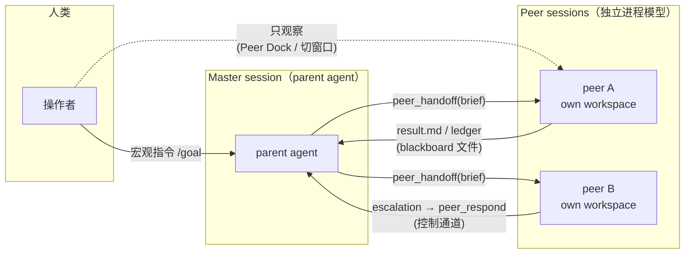
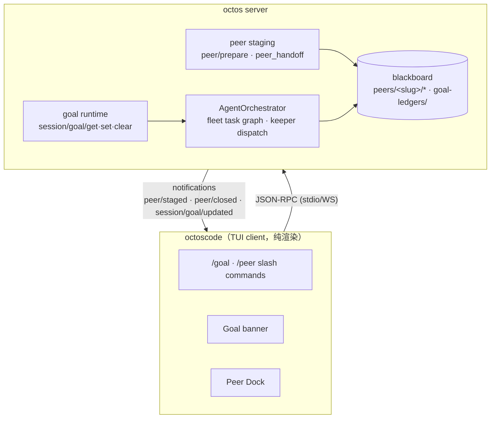
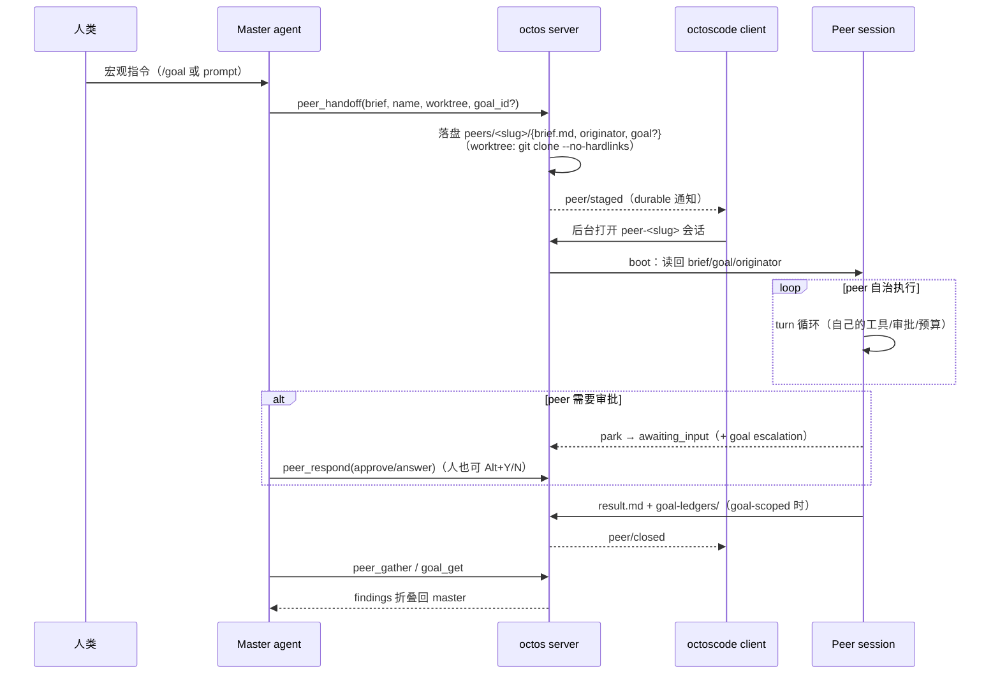

# Peer Agent + Goal Architecture

octos 的多 agent 协作系统：goal 分解为 task graph，peer agent 并行执行，client（octoscode）只做渲染和命令转发。

## 目录

- [设计渊源：线程 vs 进程](#设计渊源线程-vs-进程)
- [架构总览](#架构总览)
- [Goal 功能](#goal-功能)
- [Peer Agent 功能](#peer-agent-功能)
- [Peer × Goal 绑定与回流](#peer--goal-绑定与回流)
- [Goal + Peer 协作：Fleet](#goal--peer-协作fleet)
- [关键设计决策](#关键设计决策)
- [代码组织](#代码组织)
- [使用场景](#使用场景)
- [与类似系统的对比](#与类似系统的对比)
- [潜在改进点](#潜在改进点)

---

## 设计渊源：线程 vs 进程

Peer 机制的心智模型直接来自操作系统的并发原语：

| OS 概念 | octos 对应物 | 含义 |
|---|---|---|
| **thread** | subagent（`SpawnTool`/`DelegateTool`） | 父 turn 内派生，共享父的上下文与工作区（≈ 共享 heap/stack），父 turn 被打断则随之终止，结果作为工具结果直接回到父上下文 |
| **process** | peer agent（`peer_handoff`） | fork 出去之后有自己独立的 session、workspace（可 clone 隔离）、turn 循环与 token 预算；parent 挂了它照跑 |
| **IPC** | blackboard 文件 | parent 与 peer 之间**不共享内存**——通过 `peers/<slug>/` 下的文件通信：`brief.md`（任务契约）、`result.md`（成果）、`goal`（goal 绑定）、durable `goal-ledgers/`（账本） |
| **控制通道（signal/ptrace）** | `peer_respond` 工具 + escalation | peer park 在 approval/question 上时进入 `awaiting_input`，parent agent 用 `peer_respond` 批准/回答；goal-scoped peer 的 park 同时记入 escalation 表浮给 master |
| **进程树的 boss** | parent agent | 人类可以切窗口**观察** peer 的输出（Peer Dock / 会话切换），但设计上不直接指挥它——peer 的唯一 boss 是 parent agent；人类只对 parent 下宏观指令 |



### 为什么 goal 要放在宏观层执行

Claude Code 式的 goal 实现是**把 goal 文本每个 turn 注入到 context** 里，依赖模型在微观执行中持续 honor 它——实践中模型经常不 honor：跑几轮就停下来、或被眼前的工具输出带偏。

octos 的做法把 goal 从微观 context 中**拿出来**：

- goal 由 server 端的 keeper 在**宏观层**持有和推进（`GoalContinue` tick 自动续跑、fleet 派发、ledger 归集）；
- peer 的微观执行 context 里**没有 goal 文本**——它只看到自己的 brief（一个自包含的任务契约）；
- 于是 goal 的持续性不再依赖"模型每个 turn 都记得那段注入文本"，而是由结构保证：keeper 不断派活、收账、决定下一步，单个 peer 停了不影响 goal 前进。

这和"用户手动开很多 session 各干各的"是同构的——peer 机制把这个行为自动化了，人类只和 parent agent 说话。

---

## 架构总览



octoscode 是**纯 client**——所有 peer/goal 的逻辑都在 octos server 端，octoscode 只做：

- 解析 slash command（`/goal`, `/peer`）
- 发 RPC 请求（`peer/prepare`, `session/goal/set`）
- 接收 notification（`peer/staged`, `peer/closed`）
- 渲染 UI（Goal banner, Peer Dock）

关键约束：**session 是 client-connection-coupled 的**——server 和模型都不能自己打开会话。所以 peer 的诞生永远是两步：server 端 stage（落盘 brief），client 收到 `peer/staged` 通知后在后台打开会话。这也是 `peer_handoff` 工具只在 serve/WS 路径注册的原因（gateway/chat/ACP 没有能开会话的 client）。

---

## Goal 功能

### 用户接口

```bash
/goal <objective> [--budget <n>[k|m]]   # 设置目标 + 可选 token 预算
/goal                                    # 查看当前目标
/goal pause                              # 暂停（停止自动 continue）
/goal resume                             # 恢复
/goal stop                               # 标记完成（停止自动推进）
/goal clear                              # 清除记录
```

### Server 端行为

- **持久化目标**：`UiGoalRecord { objective, status, tokens_used, token_budget }`
- **自动推进**：goal 处于 `active` 状态时，server 定期自动生成 continuation turn（"GoalContinue" tick）
- **预算控制**：`tokens_used >= token_budget` 时状态变 `budget_limited`，停止自动推进，但**外部 wake**（fleet synthesis、peer-awaiting-input、child-completed）仍可触发
- **Fleet 分解**：server 把 goal 分解成 **task graph**，派发给多个 peer 并行执行

### UI 显示

Goal banner 显示在 transcript 顶部：

- **目标文本**（最多 3 行，超出折叠，Ctrl+P 切换）
- **状态 + 预算**：`(active · 12K/2M tokens)` 或 `(budget limited · peers still running)`
- **预算耗尽时**：如果有 peer 还在跑，显示 "budget limited · peers still running" 而不是 "⚠ budget limited"（避免误读为"一切都停了"）

相关代码：

- `src/autonomy.rs:436` — `/goal` 解析（`parse_goal`）
- `src/app.rs:3539` — Goal banner 渲染（`goal_objective_chunks`）
- `src/model.rs:4456` — `GoalObjectiveFold` 折叠偏好

---

## Peer Agent 功能

### 用户接口

```bash
/peer <brief>                    # 派生一个 peer agent，brief 是任务描述
/peer --go <brief>               # 派生并切换焦点到 peer session
/peer --worktree <brief>         # 在独立 git worktree 里跑
/peer --cwd <path> <brief>       # 指定工作目录
/peer clear                      # 清理已完成的 peer
/gather                          # 收集所有 peer 的结果
```

### Server 端流程

注意职责边界：**server 只 stage，session 由 client 打开**（session 是 client-connection-coupled 的）。

1. **Stage**（`peer/prepare` RPC 或模型侧 `peer_handoff` 工具）：server 在 `peers/<slug>/` 下落盘 durable brief（`brief.md`，上限 64KB——brief 是任务契约不是 blob 存储）、`name`、`originator`（指向 master session）、可选 `goal` 文件；返回 `slug`
2. **`peer/staged`** notification：意思是"**已 staged，请 client 打开**"——client 收到后在后台打开 `peer-<slug>` 会话，Peer Dock 显示新 peer
3. **Peer 启动**：peer session boot 时从 `peers/<slug>/` 读回 brief/goal/originator，重建自己的执行上下文；worktree 模式下 cwd 指向隔离仓库
4. **Peer 运行**：peer 有自己的 turn 循环，可以调用工具、读写文件；park 在 approval/question 上时进入 `awaiting_input`
5. **`peer/closed`** notification：peer 完成/失败/被关闭，client 更新 Peer Dock
6. **收集**：master agent 用 `peer_gather` 工具（或用户 `/gather`）从 blackboard 拉取 `result.md`



### Worktree 隔离的真实机制

`--worktree` 名义上叫 worktree，实现上是 **`git clone --no-hardlinks`**（不是 `git worktree add`）：worktree 的 `.git` 是一个指向 `<repo>/.git/worktrees/<name>` 的**文件**，而那个目录在 peer 的沙箱之外——peer 里跑任何 git 命令都会 `fatal: not a git repository`，模型还会用 `git init` "自救"从而毁掉隔离。clone 把完整 `.git` 放进 `peers/<slug>/wt`，git 正常工作、无需放宽沙箱；`--no-hardlinks` 防止 peer 写自己的 `.git` 时通过共享 inode 腐蚀源仓库对象。

### Master 侧工具族与治理

master agent 可用：`peer_handoff`（staging）、`peer_list`（roster）、`peer_gather`（收成果）、`peer_respond`（回答 park 住的 peer——控制通道）。

治理约束都在 serve 接线处：

- **depth-1**：peer session 永远看不到 `peer_handoff` 工具——peer 不能再 fork peer；
- **per-turn handoff cap**：单个 turn 里 handoff 数量有上限；
- brief ≤ 64KB、name ≤ 64 chars、重名（大小写不敏感）直接拒绝而不是自动加后缀。

### Peer Dock UI

显示在 agent strip 下方：

- **Collapsed**：一行 pill，显示 `+N peers`
- **Expanded**：每个 peer 一行，显示 slug、状态（running/waiting/done）、elapsed time
- **Peer 状态**：
  - `running`：正在执行
  - `waiting`：等待输入（`peer/awaiting_input`）
  - `done`：完成/失败/被关闭

相关代码：

- `src/store.rs:1007` — `/peer` 解析（`dispatch_peer_slash`）
- `src/model.rs:3849` — `PeerMeta` 结构
- `src/app/render.rs:77` — Peer Dock 渲染（`peer_strip_lines`）
- `src/transport.rs:7369` — `peer/prepare` RPC 编解码

### Agent-staged vs User-staged

Peer 可以由**用户**（`/peer`）或 **agent**（`peer_handoff` 工具）创建：

- `PeerMeta.agent_staged: bool` 区分来源
- Agent-staged peer 用于 **fleet task graph**（goal 分解成子任务，每个子任务一个 peer）
- User-staged peer 用于**手动委派**（"让 Edison 去修这个 bug"）

---

## Peer × Goal 绑定与回流

这是 "peer agent goal" 的核心机制——parent 在宏观层执行 goal，peer 在微观层执行 brief，两层通过 **goal 绑定文件 + 账本回流**连接：

### 绑定（handoff 时）

`peer_handoff` 携带可选 `goal_id` / `task_id`。master 在活跃 goal 下 handoff 时传入，server 把它们**原子写入** `peers/<slug>/goal`（两行 LF 分隔：`goal_id\ntask_id-or-empty`）。没有 goal 文件的 peer 行为与普通 peer 完全一致。

> ⚠️ 实测陷阱：模型不会自动传 `goal_id`——master 没有活跃 goal、或 prompt 没要求绑定时，handoff 出来的是普通 peer，产出**不会**进 goal 账本。测试回流链路时要显式要求。

### 解析（peer 侧）

peer 的 session key **不拥有 goal**。peer boot 时从 `peers/<slug>/goal` + `originator` 重建上下文（originator 只在 boot 读取一次，防 symlink/mid-turn 重绑定）；此后 peer 的 `goal_get` 按 `ctx.goal_id` + `ctx.originator_session` **直接按 id 解析**到 master 的 goal。

### 回流（master 侧）

goal-scoped peer 的产出走三条路回到 master 的 `goal_get`：

| 通道 | 载体 | 特性 |
|---|---|---|
| `peer_findings` | `peers/<slug>/result.md` | live，会被覆盖 |
| `ledger_findings` | `goal-ledgers/<goal_id>` | durable——每个 goal-scoped peer 完成 turn 时落盘，重启后仍在，是权威历史 |
| open escalations | escalation 表 | peer park 在 approval/question 时写入，master 即使错过实时通知也能在 `goal_get` 里看到谁在等 |

### Blackboard 文件布局

```
<data_dir>/
├── peers/<slug>/
│   ├── brief.md          # 任务契约（≤64KB，peer 看到的全部输入）
│   ├── name              # 人类可读名（primary address）
│   ├── originator        # master session key（boot 时读取一次）
│   ├── goal              # 两行：goal_id \n task_id-or-empty（goal-scoped 时才有）
│   ├── result.md         # peer 的 live 成果
│   └── wt/               # --worktree 时的隔离 clone
└── goal-ledgers/<goal_id> # durable 账本：findings + 状态转移
```

---

## Goal + Peer 协作：Fleet

这是核心场景：

1. **用户设置 goal**：`/goal ship the supervised-task UX by Friday --budget 2m`
2. **Server 分解 goal**：把 goal 拆成 task graph（比如 5 个子任务，有依赖关系）
3. **Server 派发 peer**：每个子任务创建一个 peer agent（`peer/prepare` with `n: Some(3)` 表示一次创建 3 个）
4. **Peer 并行执行**：每个 peer 在自己的 session/worktree 里跑
5. **Peer 完成**：`peer/closed` notification，结果写入 blackboard
6. **Server 收集结果**：`peer/gather` 拉取所有结果，synthesize 成最终答案
7. **Goal 完成**：server 标记 goal 为 `complete`

### Budget 控制

- Goal 有 `token_budget`（比如 2M tokens）
- 每个 peer 的 token 消耗累计到 goal 的 `tokens_used`
- 超过预算时 goal 变 `budget_limited`，**停止自动 continuation**，但 peer 继续跑完
- 用户可以用 `/goal <same objective> --budget 5m` 提高预算并恢复

---

## 关键设计决策

### 1. Client 是哑的

octoscode **不知道** goal 如何分解成 task graph，**不知道** peer 如何调度——全部是 server 的逻辑。Client 只渲染状态和转发命令。

**优点**：

- Server 可以独立演进（改调度算法、加新的 peer 类型）
- Client 协议稳定（`peer/prepare` 的参数从 v1 到 v3 只加了 `n` 和 `profile_id`）

**缺点**：

- Client 无法做本地优化（比如预估 goal 完成时间）
- 调试困难（goal 卡住时，client 只能看到状态，看不到 task graph）

### 2. Peer 是独立 session

每个 peer 是一个**完整的 octos session**，有自己的：

- LLM provider（可以和主 session 不同）
- 工具集（可以限制权限）
- 工作目录（可以是独立 worktree）
- Token 预算（计入 goal 总预算）

**优点**：

- 隔离性好（peer 崩溃不影响主 session）
- 权限可控（peer 可以只允许读文件，不允许写）

**缺点**：

- 开销大（每个 peer 一个 LLM 连接）
- 状态同步复杂（peer 之间通过 blackboard 文件通信，不是内存共享）

### 3. Goal 的 budget 是软限制

`budget_limited` 不是硬停止——peer 继续跑完，外部 wake 仍然触发 continuation。只是**自我推进的 GoalContinue tick** 停了。

**优点**：

- 不会半路杀死正在跑的 peer
- 用户可以看到 partial result 再决定是否加预算

**缺点**：

- 预算可能超支（peer 继续跑会消耗 token）
- 用户需要理解 "budget limited" 不是 "stopped"

---

## 代码组织

### octoscode（client）

| 文件 | 职责 |
|---|---|
| `src/autonomy.rs` | `/goal` slash command 解析（`GoalCommand` enum） |
| `src/store.rs` | `/peer` slash command 解析 + `peer/staged`/`peer/closed` notification 处理 |
| `src/model.rs` | `PeerMeta`（peer 的 client 端状态）、`GoalObjectiveFold`（goal banner 折叠偏好） |
| `src/app.rs` | Goal banner 渲染（`goal_objective_chunks`）、Peer Dock 高度计算 |
| `src/app/render.rs` | Peer Dock 渲染（`peer_strip_lines`） |
| `src/transport.rs` | RPC 编解码（`peer/prepare` request/response、`peer/staged` notification） |

### octos（server，本机 `~/Work/Projects/FW/octos`）

| 文件 | 职责 |
|---|---|
| `crates/octos-agent/src/tools/peer_handoff.rs` | `peer_handoff` 工具：参数校验（brief 64KB / name 64 chars）、staging 回调注入 |
| `crates/octos-cli/src/peers/mod.rs` | staging 落盘（brief/originator/goal 文件、clone 隔离）、slug 保留 |
| `crates/octos-cli/src/peers/host.rs` | peer boot：goal/originator 读回、`peer_respond` 解析 |
| `crates/octos-cli/src/goal_tool.rs` | `goal_get` 的按 id 解析 + findings/ledger/escalation 折叠 |
| `crates/octos-cli/src/autonomy/agent_orchestrator.rs` | goal keeper、fleet、`goal-ledgers` 读写 |
| `crates/octos-cli/src/commands/chat.rs` | `CHAT_PEER_TOOLS` 注册、peer approval 审计 |

RPC 接口（已对照 server 实现校准）：

```
peer/prepare(brief, n, worktree, cwd, session_id, profile_id)
  -> { slug, brief_path, peers: [...] }

peer/gather(slugs?)
  -> { rows: [{ slug, brief, result, status }] }

session/goal/get()
  -> { goal: { objective, status, tokens_used, token_budget } }

session/goal/set(objective, token_budget?)
  -> { ok, goal }

Notifications:
  peer/staged          — peer session 创建完成
  peer/closed          — peer 完成/失败/被关闭
  peer/awaiting_input  — peer 等待用户输入
```

---

## 使用场景

### 场景 1：大任务分解

```
用户: /goal implement OAuth login with Google and GitHub --budget 5m

Server:
  1. 分解 goal:
     - Task 1: Research OAuth 2.0 flow
     - Task 2: Implement Google provider
     - Task 3: Implement GitHub provider
     - Task 4: Add tests
     - Task 5: Write docs
  2. 创建 5 个 peer（有依赖: Task 2/3 依赖 Task 1）
  3. 并行派发 Task 1 → 等结果 → 并行派发 Task 2/3 → ...

Client UI:
  - Goal banner: "implement OAuth login... (active · 0K/5M tokens)"
  - Peer Dock: 5 行，每个 peer 显示 slug + 状态
```

### 场景 2：手动委派

```
用户: /peer --worktree fix the nav flicker on mobile

Server:
  1. 创建 peer session，brief = "fix the nav flicker on mobile"
  2. 在独立 git worktree 里跑
  3. Peer 完成后写结果到 blackboard

Client UI:
  - Peer Dock 新增一行: "fix-nav (running, 2m)"
  - Peer 完成后: "fix-nav (done, 5m)"
  - 用户: /gather → 显示 peer 的结果
```

### 场景 3：预算控制

```
用户: /goal refactor the entire codebase to use async/await --budget 10m

Server:
  1. 分解成 20 个 task
  2. 跑了 15 个 task 后 tokens_used = 10M
  3. Goal 状态变 budget_limited，停止派发新 task
  4. 正在跑的 3 个 peer 继续跑完

Client UI:
  - Goal banner: "refactor... (budget limited · peers still running)"
  - 用户看到 partial result，决定: /goal refactor... --budget 20m
  - Goal 恢复 active，继续派发剩余 task
```

---

## 与类似系统的对比

| 特性 | octos goal/peer | Cursor Composer | Claude Code subagent |
|---|---|---|---|
| 并发模型 | **multiprocessing**（peer = 独立会话/工作区） | 单 agent | **threading**（subagent 挂在父 turn 下，可并行多个） |
| 任务分解 | Server 自动分解 goal | 用户手动指定文件 | Agent 自主 spawn |
| Goal 持续性 | Keeper 在宏观层推进，goal 不进 peer 微观 context | 无 goal 概念 | goal/plan 每 turn 注入 context，依赖模型 honor，易漂移停摆 |
| 预算控制 | Goal 级 token budget | 无 | 无 |
| 隔离性 | 每 peer 独立 session + 可选 clone 隔离仓库 | 共享工作区 | 共享工作区（可选 worktree） |
| 状态持久化 | Durable brief + blackboard + goal-ledgers，重启可恢复 | 内存 | 内存（父上下文） |
| 父挂掉时 | Peer 照跑（进程语义） | — | Subagent 随父终止（线程语义） |

octos 的设计更接近 **CI/CD pipeline**（task graph + 并行执行 + 预算控制），而不是 **pair programming**（单 agent 协作）。

---

## 潜在改进点

1. **Goal 的可观测性**：client 只能看到 goal 状态和 peer 列表，看不到 task graph。可以加一个 `/goal graph` 命令显示 DAG。

2. **Peer 间通信**：master→peer 的控制通道已有（`peer_respond` 回答 park 住的 peer），但只覆盖 peer 主动提问的场景。可以加主动推送（向一个 running 且没提问的 peer 追加指令，比如 "顺便把测试也写了"）。

3. **Budget 的细粒度控制**：现在 budget 是 goal 级的。可以加 per-peer budget（"这个 peer 最多用 500K tokens"）。

4. **Peer 的失败恢复**：peer 失败后，goal 会卡住。可以加自动重试（"peer 失败后自动重新派发，最多 3 次"）。

5. **Goal 的暂停/恢复粒度**：`/goal pause` 只停 keeper 的自动推进（GoalContinue tick），正在跑的 peer 会继续（与 `budget_limited` 同语义）。可以加 per-peer 控制（"暂停/取消 Task 3 那个 peer，其他继续"）。

---

## 参考

- octoscode 源码：`src/autonomy.rs`, `src/store.rs`, `src/model.rs`, `src/app.rs`, `src/app/render.rs`, `src/transport.rs`
- octos 源码：`crates/octos-agent/src/tools/peer_handoff.rs`, `crates/octos-cli/src/peers/`, `crates/octos-cli/src/goal_tool.rs`, `crates/octos-cli/src/autonomy/agent_orchestrator.rs`
- octos-core RPC 协议：`UiGoalRecord`, `UiAgentRecord`, `peer/prepare`, `peer/staged`, `peer/closed`
- Workstream 契约：`octos/workstreams/M15-agent-goal-loop-autonomy.md`（agent/goal/loop 的后端编排契约）
- 相关 issue：octos#1800 (peer agents v1), octos#1801 (peer agents v2/v3), octos#1967 (escalation 回读), octoscode#395, octoscode#407
